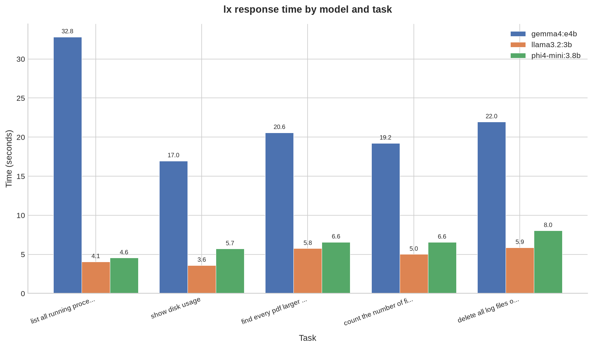

# Benchmarks

Informal benchmarking of locally available Ollama models against `lx`'s core task: turning a plain-English request into structured JSON (`command`, `explanation`, `risk`).

Run via `scripts/benchmark.py`, a standalone dev tool (not part of the installed `lx` package) that discovers your locally pulled models, times each one against a fixed set of tasks, and generates a comparison chart.

**Hardware:** Intel i7-1065G7 (4 cores / 8 threads), 16GB RAM, CPU-only inference (no dedicated GPU).

## Models tested

- `phi4-mini:3.8b`
- `llama3.2:3b`
- `gemma4:e4b` (the default model shown first if no `LX_MODEL` override is set)

## Results

| Model | Avg time (s) | Fastest task | Slowest task |
|---|---|---|---|
| `llama3.2:3b` | ~8.9 | 5.2s | 18.3s |
| `phi4-mini:3.8b` | ~11.2 | 5.4s | 18.7s |
| `gemma4:e4b` | ~28.8 | 18.3s | 40.9s |

These numbers are from a single run each and vary somewhat between runs on this hardware (see "A note on variability" below). Treat them as directionally indicative, not precise, reproducible figures.

## Findings

**Speed:** across every task, the two smaller (~3-4B) models were consistently 2-4x faster than `gemma4:e4b`. On CPU-only hardware, model size directly and substantially affects response latency, as expected, and matches the tradeoff discussed when originally choosing a model for this project.

**JSON reliability, in aggregate:** most runs produced valid, parseable JSON on the first attempt. Earlier development testing (see the project's commit history and the "Follow-up finding" below) showed this isn't guaranteed, particularly for tasks requiring escaped characters or nested quoting inside the generated shell command.

**Command correctness, a more concerning finding than JSON validity alone:** even when JSON parsed successfully, the *shell command itself* wasn't always correct:

- `llama3.2:3b` produced a truncated, syntactically invalid command for the "delete old log files" task in two separate runs: `find /var/log -type f -mtime +30 -exec rm {} \`, missing the `\;` or `+` terminator required by `-exec`. This looks like a consistent weakness for this model on this specific task pattern, not a one-off fluke, and it was labelled "low risk" both times.
- `phi4-mini:3.8b` produced commands with unusual or invalid quoting on the PDF-search task across different runs, including wrapping the entire command in an extra layer of single quotes that shouldn't be there.

**Risk labelling varies between runs:** the same "delete old log files" task was labelled `medium` in one run and `high` in another by `phi4-mini`, for a functionally similar command. Risk classification is the model's own judgement call, not a deterministic calculation, treat it as a helpful signal, not a guarantee.

## Follow-up finding: nested quoting and JSON reliability

A separate, harder real-world test task, "change all file extensions in a folder from .png to .jpg", surfaced a deeper reliability issue than simple backslash-escaping.

This task naturally invites a shell command with **nested quoting**, something like `bash -c 'mv "$file" "${file%.png}.jpg"'`, requiring both single quotes (for the outer `-c` argument) and double quotes (for variable expansion inside it). Representing that correctly as a JSON string value requires escaping the inner double quotes (`\"`). `phi4-mini:3.8b` failed to do this consistently across multiple attempts and retries, even after:

- Prompt engineering specifically warning about quote escaping
- Enabling Ollama's `"format": "json"` constrained-decoding option, which forces syntactically valid JSON at the token level

With `format: json` enabled, `phi4-mini` did produce syntactically valid JSON, but at the cost of dropping the `explanation` and `risk` fields entirely on this task, suggesting the model was already at its structural limit for the combined demands of correct nested quoting *and* the full three-field schema.

`gemma4:e4b` succeeded on the same task, first attempt, no retries needed, producing a simpler `for` loop instead of a nested `bash -c` pattern, both correctly escaped in JSON *and* structurally simpler to begin with.

**Takeaway:** for tasks requiring nested shell quoting, smaller local models may be unable to reliably produce valid structured output, even with strong prompt engineering and format constraints. Larger models may succeed both by escaping correctly and by naturally choosing simpler, less quote-heavy command structures. This is a genuine capability ceiling, not something `lx`'s repair/retry logic can fully paper over.

## A note on variability

Response times for `gemma4:e4b` were noticeably higher in a later benchmark run (40.9s for the slowest task) than an earlier one (28.9s for the same task), despite no code changes affecting model inference. This is a reminder that CPU-only, shared-hardware benchmarking is inherently noisy: background processes, thermal throttling, and residual memory/swap pressure from prior test runs can all meaningfully affect results. Numbers here should be read as rough, directional comparisons between models on the same run, not as precise, universally reproducible benchmarks.

## Takeaways

- Smaller models are meaningfully faster on CPU-only hardware.
- Valid JSON structure does not guarantee a correct or runnable shell command; this reinforces why `lx` never auto-executes anything, a human reviewing the command before running it is a real safeguard, not a formality.
- Risk labels are a helpful signal from the model, not a verified guarantee.
- Some tasks (particularly those requiring nested shell quoting) may exceed what smaller local models can reliably express as structured output, regardless of prompt engineering or format constraints.

## Caveats

This is a small, informal benchmark (5 fixed tasks, 3 models, generally single runs per data point), not a rigorous statistical evaluation. Results may vary across hardware, Ollama versions, model versions, and system load at the time of testing.